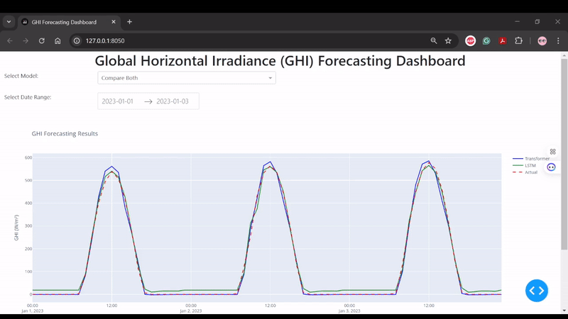

# GHI Transformer Forecasting

## Overview


This study implements advanced time series forecasting models to predict **Global Horizontal Irradiance (GHI)** using
historical data. The implementation includes state-of-the-art models such as **Transformer** and **LSTM**,
with a focus on parallelization and handling long-term dependencies in time series data.
---

## Publication
You can check the white preprint paper here:
- **Transformer-Based Global Horizontal Irradiance Forecasting: A Multi-Head Attention Approach for Hour-Ahead Predictions**  
  Published on ResearchGate.  
  [Read the paper here](https://www.researchgate.net/publication/388350500_Transformer-Based_Global_Horizontal_Irradiance_Forecasting_A_Multi-Head_Attention_Approach_for_Hour-Ahead_Predictions)

---

## Models Implemented
- **Transformer**: A multi-head attention-based model for parallelized time series forecasting.
- **LSTM (Long Short-Term Memory)**: A recurrent neural network designed to capture long-term dependencies.

---
## Results

| Model        | RMSE  | nRMSE  | MAE   | MASE  |
|--------------|-------|--------|-------|-------|
| Transformer  | 15.58 | 0.1135 | 9.22  | 0.19  |
| LSTM         | 17.53 | 0.1276 | 15.03 | 0.32  |

---

## Interactive Visualizations
The project includes an interactive dashboard built with **Dash** and **Plotly**. Key features:
- **Model Comparison**: Compare predictions from Transformer and LSTM.
- **Time Range Slider**: Focus on specific time periods.
- **Metrics Display**: Real-time RMSE, nRMSE, MAE and MASE for selected models.

---

## Installation

1. Clone the repository:
    ```bash
    git clone https://github.com/Hamid701/GHI-Transformer-forecasting.git
    cd GHI-Transformer-forecasting
    ```

2. Install the required dependencies:
    ```bash
    pip install -r requirements.txt
    ```

---

## Usage

1. Run the the script:
    ```bash
    python src/main.py
    ```

2. Outcome:

- Evaluate the models on the test set.

- Save metrics to [metrics.txt](results/metrics.txt).

- Generate an interactive plot in [forecast_plot.html](visualization/forecast_plot.html).

3. Run the dashboard locally:
    ```bash
    python src/dashboard.py
    ```

Open your browser and navigate to [http://127.0.0.1:8050](http://127.0.0.1:8050) to view the interactive dashboard.

Here's a quick demo of the GHI Forecasting Dashboard:



## Contributing

Contributions are welcome! Please follow these steps:
1. Fork the repository.
2. Create a new branch for your feature or bugfix.
3. Submit a pull request with a detailed description of your changes.

## Future Work

- **Add Exogenous Variables**: Incorporate additional input features such as wind speed, temperature, and humidity to improve model accuracy.
- **Experiment with Hybrid Models**: Explore the performance of hybrid models that combine the strengths of Transformers and LSTMs.
- **Integrate Real-Time Data Updates**: Enable the dashboard to fetch and display real-time data for up-to-date forecasting.

## Acknowledgments

The Transformer architecture is based on the paper "Attention is All You Need".

The dataset is provided by the Copernicus Atmosphere Monitoring Service (CAMS).

## License

This project is licensed under the MIT License. See [LICENSE](LICENSE) for details.

