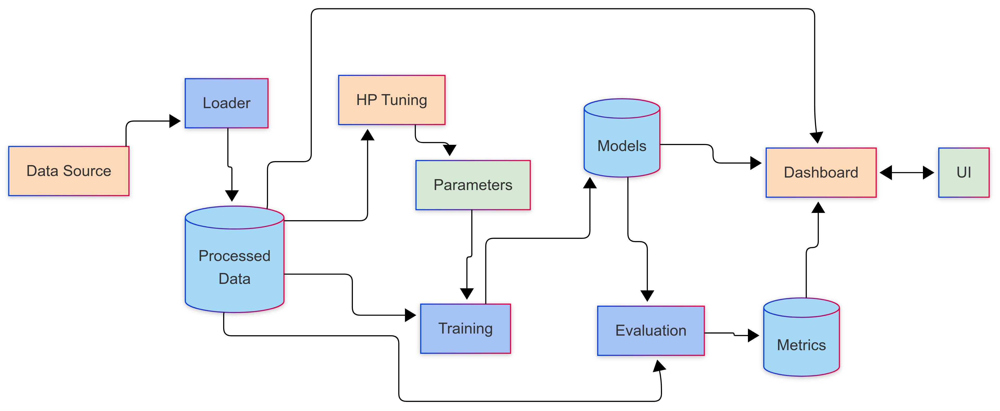

# GHI Transformer Forecasting

## Overview
Due to global warming, the world is seeking to use more renewable energy. In this study, we focus on solar energy. The integration of solar energy into electricity networks requires reliable forecast information of solar resources enabling it to quantify the available energy and allowing it to optimally manage the transition between intermittent and conventional energies. Recurrent Neural Networks (RNN) powered with Long Short-Term Memory (LSTM) units, and convolutional Neural Networks (CNN) have achieved state of the art in Photovoltaic output and solar radiation forecasting tasks. But these recurrent models face the parallelization problem during training because of their sequential nature, which holds problems memorizing long-term dependencies. To solve this problem, for the first time, we introduce a novel approach for Global Horizontal radiation (GHI) forecasting, which is based on the multi-head attention mechanism used recently in language translation tasks. This approach works by using self-attention mechanisms to learn long and short-term dependencies from time series data in a parallel mode. Using hourly GHI data in different regions, we demonstrate that the forecasting results for different horizons produced by our approach show significant performance improvements over existing benchmark models.
## Objectif
This study implements advanced time series forecasting models to predict **Global Horizontal Irradiance (GHI)** using
historical data. The implementation includes state-of-the-art models such as **Transformer** and **LSTM**,
which focus on parallelization and handling long-term dependencies in time series data.

---

## Publication
You can check the white preprint paper here:
- **Transformer-Based Global Horizontal Irradiance Forecasting: A Multi-Head Attention Approach for Hour-Ahead Predictions**  
  [Read the paper here](https://www.researchgate.net/publication/388350500_Transformer-Based_Global_Horizontal_Irradiance_Forecasting_A_Multi-Head_Attention_Approach_for_Hour-Ahead_Predictions)

---

## Models Implemented
- **Transformer**: A multi-head attention-based model for parallelized time series forecasting.
- **LSTM (Long Short-Term Memory)**: A recurrent neural network designed to capture long-term dependencies.

---

## Data Flow Diagram



--- 
## Results

Evaluation Metrics:
Model        | RMSE     | nRMSE    | MAE      | MASE    
-------------------------------------------------------
Transformer  | 12.40    | 0.0902   | 7.41     | 0.16    
LSTM         | 15.54    | 0.1131   | 10.04    | 0.21 


Other models were developed on R and not added to this repository.
---

## Interactive Visualizations
The project includes an interactive dashboard built with **Dash** and **Plotly**. Key features:
- **Model Comparison**: Compare predictions from Transformer and LSTM.
- **Time Range Slider**: Focus on specific time periods.
- **Metrics Display**: Real-time RMSE, nRMSE, MAE and MASE for selected models.
- **Download**: Download the predictions to your local device as .csv file.

---

## Installation

1. Clone the repository:
    ```bash
    git clone https://github.com/Hamid701/GHI-Transformer-forecasting.git
    cd GHI-Transformer-forecasting
    ```

2. Install the required dependencies:
    ```bash
    pip install -r requirements.txt
    ```

---

## Usage

1. Run the the script:
    ```bash
    python src/main.py
    ```

2. Outcome:

- Evaluate the models on the test set.

- Save metrics to [metrics_20250211_124625.txt](results\metrics_20250211_124625.txt).

- Generate an interactive plot in [forecast_plot_20250211_124625.html](visualization\forecast_plot_20250211_124625.html).

3. Run the dashboard locally:
    ```bash
    python src/dashboard.py
    ```

Open your browser and navigate to [http://127.0.0.1:8050](http://127.0.0.1:8050) to view the interactive dashboard.

Here's a quick demo of the GHI Forecasting Dashboard:

<video width="600" controls>
  <source src="visualization\Dash-Preview.mp4" type="video/mp4">
  Your browser does not support the video tag.
</video>


## Contributing

Contributions are welcome! Please follow these steps:
1. Fork the repository.
2. Create a new branch for your feature or bugfix.
3. Submit a pull request with a detailed description of your changes.

## Future Work

- **Add Exogenous Variables**: Incorporate additional input features such as wind speed, temperature, and humidity to improve model accuracy.
- **Experiment with Hybrid Models**: Explore the performance of hybrid models that combine the strengths of Transformers and LSTMs.
- **Integrate Real-Time Data Updates**: Enable the dashboard to fetch and display real-time data for up-to-date forecasting.

## Acknowledgments

The Transformer architecture is based on the paper "Attention is All You Need".

The dataset is provided by the Copernicus Atmosphere Monitoring Service (CAMS).

## License

This project is licensed under the MIT License. See [LICENSE](LICENSE) for details.
